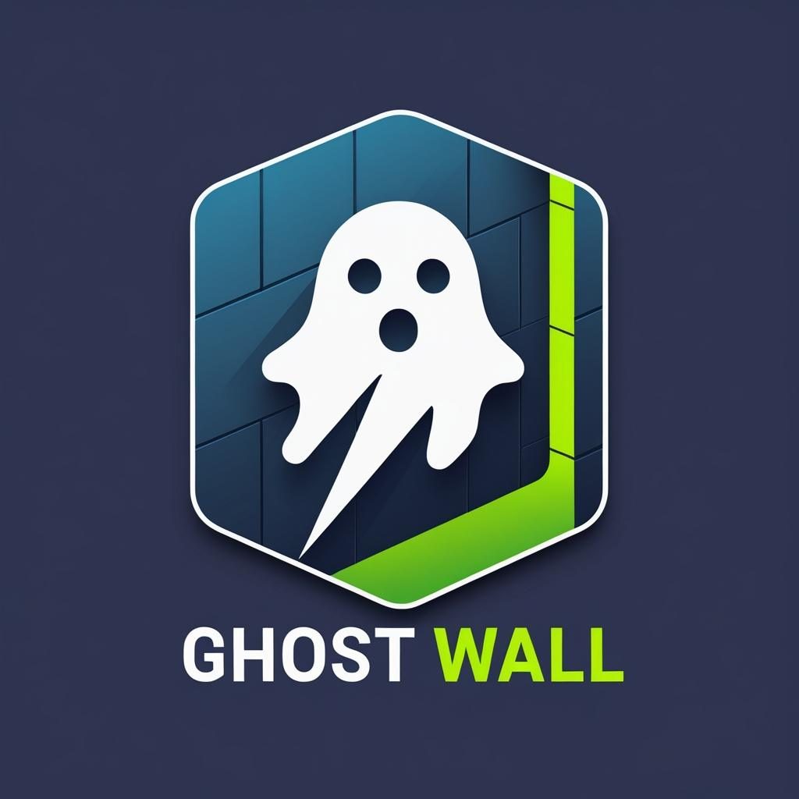

# Ghost Wall

  

  🔗 <a href="https://www.linkedin.com/in/taauxick/" target="_blank">Connect with me on LinkedIn</a>

**Ghost Wall** is a browser extension that detects and blocks third-party tracking scripts on web pages. It gives you visibility and control over which domains are tracking you, and lets you manage your own whitelist and blacklist for maximum privacy.

---

## Features

- **Detects third-party trackers:** Scans every page you visit and lists all detected third-party scripts and trackers.
- **Blocks trackers:** Blocks known ad, analytics, and social trackers using built-in rules.
- **Custom blacklist/whitelist:** Add or remove domains to your personal blacklist or whitelist.
- **Per-site blocking:** Enable or disable blocking for specific sites with a simple toggle.
- **Domain classification:** Trackers are categorized (Ads, Analytics, Social, CDN, Cloud, Google, Other) and color-coded for easy identification.
- **Modern UI:** Clean, responsive popup with dark mode support.
- **Theme toggle:** Instantly switch between light and dark mode.
- **Manage lists:** Easily view and remove domains from your whitelist or blacklist.
- **One-click blocking/unblocking:** Instantly block or allow any detected domain.
- **Badge system:** Red (danger), Yellow (mid), Green (safe), Grey (other/unknown).
- **Open source:** No hidden tracking, your privacy is respected.
- **Works on all major browsers:** Chrome, Edge, Brave, Opera, and Firefox (with Manifest V3 support).

---

## Installation

### **Google Chrome / Brave / Edge / Opera**

1. **Clone or Download this repository.**
2. Open your browser and go to `chrome://extensions/` (or `edge://extensions/` for Edge, `brave://extensions/` for Brave, `opera://extensions/` for Opera).
3. Enable "Developer mode" (top right).
4. Click "Load unpacked" and select the extension folder (`ple  main - Copy`).
5. You should now see the Ghost Wall icon in your browser toolbar.

### **Mozilla Firefox (Manifest V3 support required)**

1. Go to `about:debugging#/runtime/this-firefox`
2. Click "Load Temporary Add-on..."
3. Select the `manifest.json` file from the extension folder.
4. The extension will load temporarily (for permanent install, submit to AMO or use developer mode).

---

## Usage

- Click the **Ghost Wall** icon to open the popup on any page.
- See a list of detected third-party domains, their category, and block status.
- Use the toggle to enable/disable blocking for the current site.
- Add domains to your blacklist or whitelist using the input box.
- Manage your lists with the "Manage Whitelist/Blacklist" button.
- Click the theme toggle (☀️/🌙) for dark mode.
- Instantly block or allow any detected domain with one click.
- View color-coded badges for quick risk assessment.

---

## Domain Categories & Badges

- 🟥 **Ads / Social**: Red badge (dangerous, usually blocked)
- 🟨 **Analytics**: Yellow badge (medium risk)
- 🟩 **CDN / Google / Cloud**: Green badge (generally safe)
- ⬜ **Other**: Grey badge (unknown, treat with caution)

---

## How It Works

- Uses Chrome's [declarativeNetRequest API](https://developer.chrome.com/docs/extensions/reference/declarativeNetRequest/) to block known trackers.
- Content script scans all `<script>` tags and external resources to detect third-party domains.
- Popup UI shows all detected domains, their category, and allows quick management.
- All settings are stored locally in your browser's extension storage.
- No data is sent to any server; everything runs locally.

---

## Privacy

Ghost Wall does **not** collect, store, or transmit your browsing data. All detection and blocking happens locally in your browser.

---

## Development

- **Technologies:** JavaScript, HTML, CSS, Chrome Extensions API
- **Main files:**
  - `manifest.json` — Extension manifest
  - `popup.html`, `popup.js`, `popup.css` — Popup UI and logic
  - `background.js` — Background logic and rules
  - `content.js` — Content script for scanning
  - `rules.json` — Blocklist rules

---
## Contributions & Suggestions

We ❤️ contributions and suggestions!

Whether you want to report a bug, suggest a new feature, improve the UI, or help with documentation—**your input is always welcome**.  
Feel free to open an [issue](https://github.com/your-repo/issues) or submit a [pull request](https://github.com/your-repo/pulls).

**How to contribute:**
- Fork this repository
- Create a new branch for your feature or fix
- Make your changes and commit them
- Open a pull request with a clear description

If you have ideas to make Ghost Wall even better, don’t hesitate to share them.  
Let’s build a safer, more private web together!
